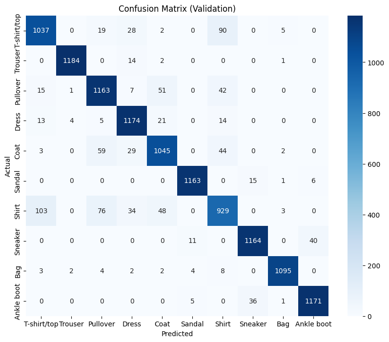
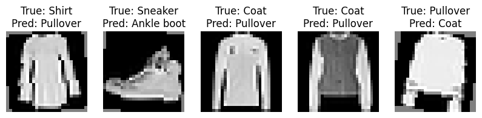

# Multi-Object Image Classification via Convolutional Neural Network on MNIST dataset

## Problem Overview
Fashion MNIST is a widely used benchmark that replaces the original MNIST datatset of handwritten digits. It comprises of 70,000 images; each image is 28x28 pixels in grayscale. 
In Fashion MNIST we have 10 classes and also the difficulty is increased by having images very similar to each other such as shirt and T-shirts in this new datatset. 
Fashion MNIST classes:
| Class | Label |
|:------:|:---------------------:|
| 0 | T-shirt/top |
| 1 | Trouser |
| 2 | Pullover |
| 3 | Dress |
| 4 | Coat |
| 5 | Sandal |
| 6 | Shirt |
| 7 | Sneaker |
| 8 | Bag |
| 9 | Ankle boot |

## Prerequisites
```bash
pip install -r requirements.txt
```
## Data Preprocessing 
Data preprocessing included normalization to scale the pixel values to range [-1,1], random rotation (up to 10 degrees), and random horizontal flipping with a 50% probability to enhance the generalizablity of the the model. 

## Model Architecture
The model architecture was implemented using PyTorch. It consists of multiple convolutional layers followed by batch normalization, ReLU activations and max pooling layers to extract meaningful features from the images. The final fully connected layers are structured to generate output class probabilities through a softmax layer. <br>

<div align="center">
  <b>Hierarchical Representation of CNN Architecture</b>
</div> 

<div align="center">
    
</div>

The optimized model achieved a validation accuracy of 91% with a corresponding F1-score of 0.89. We have used confusion matrix to support our analysis. 


The highest accuracy was observed for classes like Ankle Boot and Trouser, while the model struggled slightly with distinguishing Shirt from T-shirt due to visual similarities.

To gain further insights into the learned representations of the model, we used UMAP a dimensionality reduction technique that helps visualize high-dimensional data in a two-dimensional space.


The plot shows that the embeddings of different classes are generally well-separated, indicating that the model was able to learn meaningful representations for each clothing item. However, some overlap was observed between similar classes, such as Shirt and T-shirt, which corresponds with the observed misclassification errors.

Hyperparameter tuning for the model was performed using Optuna, which resulted in an optimal learning rate of 0.001 and a batch size of 64. The training and validation loss and accuracy over epochs, as well as the average loss and accuracy across 5 folds for the training and validation data, were visualized and plotted to gain deeper insights.

# Loss Accuracy Plots
This section displays individual loss accuracy plots for different configurations of dropout, learning rate, and epochs. Each plot represents the performance of a model based on these parameters.
<table border="1" align="center">
  <tr>
    <td align="center">
      
      <br>Dropout: 0.2163<br>Learning Rate: 0.0007019<br>Epochs: 5
    </td>
    <td align="center">
      
      <br>Dropout: 0.2807<br>Learning Rate: 0.0002627<br>Epochs: 11
    </td>
  </tr>
  <tr>
    <td align="center">
      
      <br>Dropout: 0.3485<br>Learning Rate: 0.0001965<br>Epochs: 15
    </td>
    <td align="center">
      
      <br>Dropout: 0.3896<br>Learning Rate: 0.0003006<br>Epochs: 18
    </td>
  </tr>
  <tr>
    <td align="center">
      
      <br>Dropout: 0.3963<br>Learning Rate: 0.0002274<br>Epochs: 6
    </td>
    <td align="center">
      
      <br>Dropout: 0.4174<br>Learning Rate: 0.0001271<br>Epochs: 8
    </td>
  </tr>
  <tr>
    <td align="center">
      
      <br>Dropout: 0.45<br>Learning Rate: 0.001<br>Epochs: 18
    </td>
    <td align="center">
      
      <br>Dropout: 0.4731<br>Learning Rate: 0.0001203<br>Epochs: 12
    </td>
  </tr>
  <tr>
    <td align="center">
      
      <br>Dropout: 0.4999<br>Learning Rate: 0.0009574<br>Epochs: 14
    </td>
    <td align="center">
      
      <br>Dropout: 0.5399<br>Learning Rate: 0.002960<br>Epochs: 18
    </td>
  </tr>
  <tr>
    <td align="center">
      
      <br>Dropout: 0.5761<br>Learning Rate: 0.0003109<br>Epochs: 10
    </td>
    <td align="center">
      <!-- Leave this cell empty if needed -->
    </td>
  </tr>
</table>

# Loss Accuracy Plot across 5 Folds
This plot shows the average loss accuracy across five different training folds, providing a comprehensive view of the model's performance across multiple runs.


The output of the model is the classification of images into the 10 classes 


## Challenges and Limitations
The analysis of misclassified samples highlighted challenges in distinguishing between visually similar classes. This limitation suggests that additional techniques, such as advanced feature extraction or attention mechanisms, could be explored to further improve classification performance.<br>

<div align="center">
  <b>Missclassified Images Test</b>
</div> 


<div align="center">
  <b>Missclassified Images Validation</b>
</div> 


